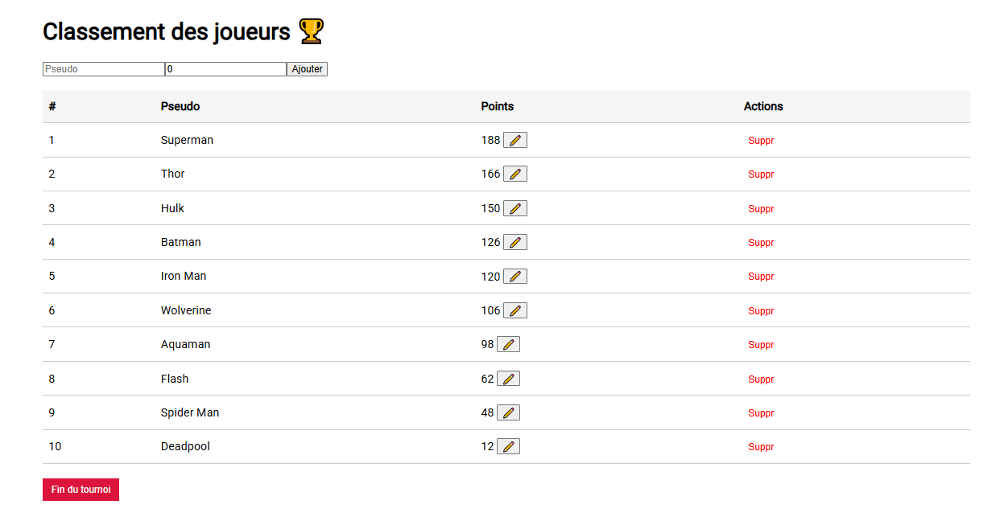

# 🏆 Player Ranking API

API REST en Ktor + MongoDB pour gérer le classement de joueurs d’un tournoi.



## ✅ Fonctionnalités
- Ajouter un joueur
- Mettre à jour ses points
- Voir son classement
- Liste des joueurs triés par score
- Supprimer tous les joueurs

## 🚀 Lancer l’application

### Prérequis
- Docker installé
- Java 17
- Git Bash ou terminal Linux/Mac

### Démarrage

```bash
./start.sh